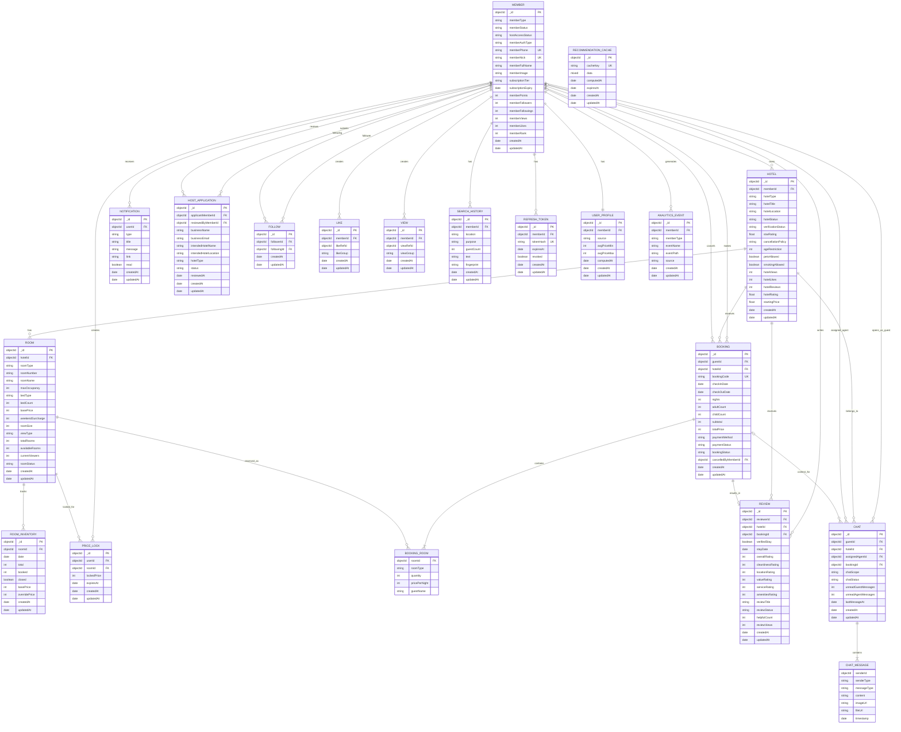

# Meomul ER Model

This diagram is a logical ER model derived from the current backend Mongoose schemas in `/Users/kamil/Desktop/Meomul/meomul/apps/meomul-api/src/schemas`.

## Notes

- `BOOKING_ROOM` and `CHAT_MESSAGE` are modeled here as logical child entities. In the codebase they are embedded subdocuments inside `Booking` and `Chat`.
- `LIKE.likeRefId` and `VIEW.viewRefId` are polymorphic references. In practice they point to different entities based on `likeGroup` and `viewGroup`, most commonly `Hotel`.
- `RECOMMENDATION_CACHE` is a standalone cache collection and does not have a direct foreign-key relation to the main transactional entities.
